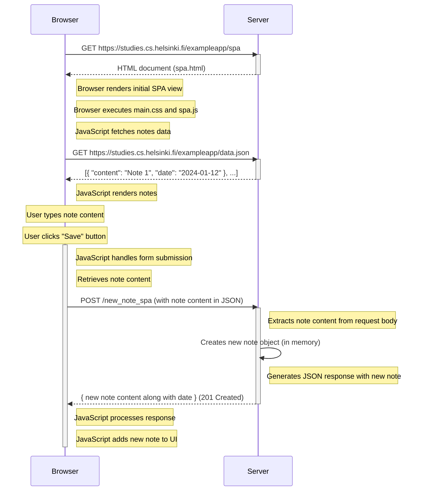

```mermaid
sequenceDiagram
  participant Browser
  participant Server

  Browser->>Server: GET https://studies.cs.helsinki.fi/exampleapp/spa
  activate Server
  Server-->>Browser: HTML document (spa.html)
  deactivate Server

  Note right of Browser: Browser renders initial SPA view
  Note right of Browser: Browser executes main.css and spa.js

  Note right of Browser: JavaScript fetches notes data
  Browser->>Server: GET https://studies.cs.helsinki.fi/exampleapp/data.json
  activate Server
  Server-->>Browser: [{ "content": "Note 1", "date": "2024-01-12" }, ...]
  deactivate Server

  Note right of Browser: JavaScript renders notes

  Note over Browser: User types note content
  Note over Browser: User clicks "Save" button
  activate Browser
  Note right of Browser: JavaScript handles form submission
  Note right of Browser: Retrieves note content
  Browser->>Server: POST /new_note_spa (with note content in JSON)
  activate Server
  Note right of Server: Extracts note content from request body
  Server->>Server: Creates new note object (in memory)
  Note right of Server: Generates JSON response with new note
  Server-->>Browser: { new note content along with date } (201 Created)
  deactivate Server
  Note right of Browser: JavaScript processes response
  Note right of Browser: JavaScript adds new note to UI
  deactivate Browser
```
